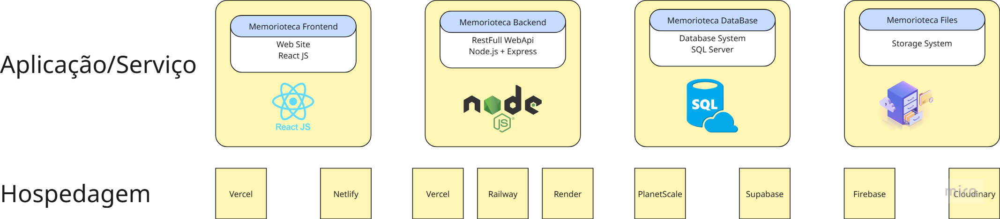

# Especificações do Projeto

<span style="color:red">Pré-requisitos: <a href="01-Documentação de Contexto.md"> Documentação de Contexto</a></span>

Definição do problema e ideia de solução a partir da perspectiva do usuário. 

## Usuários
| Tipo de Usuário   | Descrição | Responsabilidades |
|------------------|-----------|------------------|
| **xxx** | xxxxx | xxxxx |

### Exemplo

| Tipo de Usuário   | Descrição | Responsabilidades |
|------------------|-----------|------------------|
| **Administrador** | Gerencia a aplicação e os usuários. | Gerenciar usuários, configurar o sistema, acessar todos os relatórios. |
| **Funcionário** | Usa a aplicação para suas tarefas principais. | Criar e editar registros, visualizar relatórios. |


## Arquitetura e Tecnologias

A aplicação será composta dos seguintes componentes:

### Memorioteca Frontend
**Tipo:** Website  
**Tecnologia:** ReactJS

**Hospedagem (opções):**
- Vercel
- Netlify

---

### Memorioteca Backend
**Tipo:** RESTful Web API  
**Tecnologia:** Node.js + Express

**Hospedagem (opções):**
- Vercel
- Railway
- Render

---

### Memorioteca Database
**Tipo:** Database System  
**Tecnologia:** SQL

**Hospedagem (opções):**
- PlanetScale
- Supabase

---

### Memorioteca Files
**Tipo:** Storage System  

**Hospedagem (opções):**
- Firebase
- Cloudinary

---

### Diagrama de Arquitetura



*Diagrama ilustrando a arquitetura e comunicação entre os componentes do sistema Memorioteca*

## Project Model Canvas

Project Model Canvas construído através da seguinte ferramenta indicada no Microfundamento: https://app.projectcanvas.online


- Link Projec Model Canvas lista - https://github.com/ICEI-PUC-Minas-PMV-ADS/pmv-ads-2025-2-e5-proj-empext-t3-memorioteca/blob/main/documentos/docs/Project%20Model%20Canva%20-%20Lista.pdf
  
- Link Project Model Canvas quadro - https://github.com/ICEI-PUC-Minas-PMV-ADS/pmv-ads-2025-2-e5-proj-empext-t3-memorioteca/blob/main/documentos/docs/Project%20Model%20Canva%20-%20Quadro.pdf


## Requisitos

As tabelas que se seguem apresentam os requisitos funcionais e não funcionais que detalham o escopo do projeto. Para determinar a prioridade de requisitos, aplicar uma técnica de priorização de requisitos e detalhar como a técnica foi aplicada.

Para mais informações, consulte os microfundamentos Fundamentos de Engenharia de Software e Engenharia de Requisitos de Software. 

### Requisitos Funcionais

|ID    | Descrição do Requisito  | Prioridade |
|------|-----------------------------------------|----|
|RF-001| A aplicação deve permitir o cadastro de novos usuarios | ALTA | 
|RF-002| A aplicação deve permitir que usuários (visitantes e administradores) cadastrados realizem login | ALTA |
|RF-003| A aplicação deve possibilitar a criação de perfis de usuário com permissoes especificas | ALTA | 
|RF-004| A aplicação deve restringir funcionalidades de acordo com o perfil do usuario | ALTA | 
|RF-005| A aplicação deve permitir o cadastro, consulta, edição e exclusão de projetos | ALTA |  
|RF-006| A aplicação deve possuir um painel para exibição de projetos em destaque | BAIXA | 
|RF-007| A aplicação deve possui funcionalidade de busca avançada de projetos | BAIXA | 
|RF-008| A aplicação deve permitir que visitantes entrem em contato com a equipe da biblioteca | MEDIA | 
|RF-009| A aplicação deve possuir tela contendo informações institucionais | MEDIA |
|RF-010| A aplicação deve permitir o cadastro de informações de divulgação do projeto | BAIXA | 

### Requisitos não Funcionais

| ID      | Descrição do Requisito | Categoria ISO/IEC 25010 | Prioridade |
|---------|------------------------|-------------------------|------------|
| RNF-001 | O sistema deve ser responsivo, adaptando-se automaticamente a diferentes tamanhos de tela e sistemas operacionais móveis. | Portabilidade / Usabilidade | MÉDIA |
| RNF-002 | O sistema deve processar requisições do usuário em até 3 segundos, sob condições normais de rede e carga. | Desempenho / Eficiência | BAIXA |
| RNF-003 | A interface do sistema deve seguir princípios de design centrado no usuário, com navegação intuitiva, feedback claro e consistência visual. | Usabilidade | BAIXA |
| RNF-004 | A aplicação deve proteger dados sensíveis dos usuários contra acessos não autorizados, utilizando criptografia, autenticação forte e controle de acesso, conforme diretrizes da LGPD e OWASP. | Segurança | ALTA |
| RNF-005 | A interface deve apresentar contraste adequado entre elementos visuais, atendendo aos critérios de acessibilidade definidos pelas diretrizes WCAG 2.1. | Usabilidade / Acessibilidade | MÉDIA |
| RNF-006 | O sistema deve ser compatível com os principais navegadores modernos (Chrome, Firefox, Edge, Safari). | Compatibilidade / Portabilidade | MÉDIA |
| RNF-007 | O sistema deve estar disponível 99,5% do tempo, considerando o período mensal. | Confiabilidade / Disponibilidade | ALTA |
| RNF-008 | O sistema deve permitir fácil manutenção e atualização, com documentação clara e modularidade no código. | Manutenibilidade | MÉDIA |

## Restrições

O projeto está restrito pelos itens apresentados na tabela a seguir.

|ID| Restrição                                             |
|--|-------------------------------------------------------|
|R-01|O projeto deverá ser entregue até o final do semestre|
|R-02|A aplicação não deve ser realizada por terceiros fora do grupo|
|R-03|A aplicação deve ser desenvolvida utilizando linguagem e padrões em comum acordo com os integrantes do grupo|


## Diagrama de Caso de Uso


## Modelo da Base de Dados

### Modelo Entidade-Relacionamento


### Projeto Físico da Base de Dados
 ```sql
Usuarios
CREATE TABLE Usuarios (
    id_usuario INT [PK],
    nome VARCHAR(100) NOT NULL,
    email VARCHAR(100) UNIQUE NOT NULL,
    senha VARCHAR(255) NOT NULL,
    tipo ENUM('Administrador','Visitante') NOT NULL
);

Perfis
CREATE TABLE Perfis (
    id_perfil INT [PK],
    id_usuario INT NOT NULL [FK]
);

Projetos
CREATE TABLE Projetos (
    id_projeto INT [PK],
    id_usuario INT NOT NULL  [FK],
    titulo VARCHAR(150) NOT NULL,
    descricao TEXT NOT NULL,
    data_criacao DATETIME DEFAULT CURRENT_TIMESTAMP
);

Informações Institucionais
CREATE TABLE InformacoesInstitucionais (
    id_info  [PK],
    id_usuario INT NOT NULL [FK],
    titulo VARCHAR(150) NOT NULL,
    descricao TEXT,,
    endereco VARCHAR(255) NOT NULL,
    telefone VARCHAR(20) NOT NULL
);

Contatos
CREATE TABLE Contatos (
    id_contato [PK],
    id_usuario INT NOT NULL [FK],
    nome VARCHAR(100) NOT NULL,
    email VARCHAR(100) UNIQUE NOT NULL,
    mensagem TEXT NOT NULL,
    data_envio DATETIME DEFAULT CURRENT_TIMESTAMP
);
```
